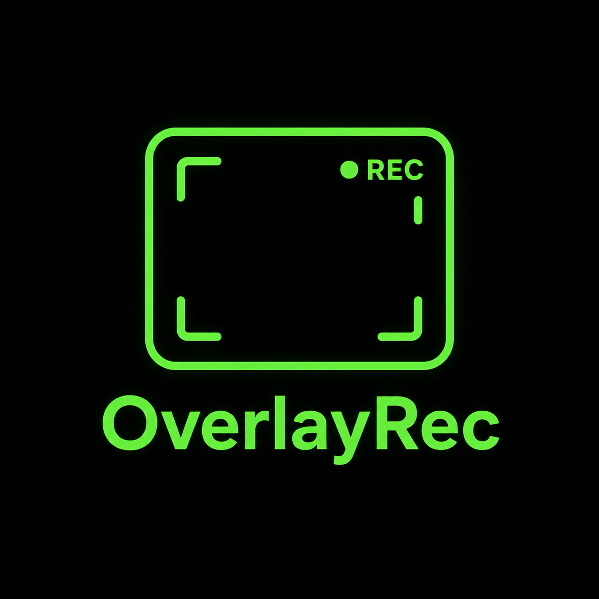
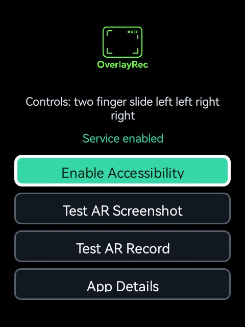
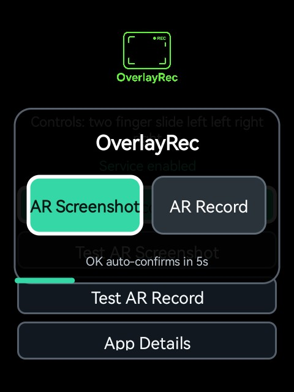

# OverlayRec



OverlayRec is a lightweight Rokid Glasses utility for triggering AR screenshots and AR video recording without opening the Hi Rokid app first.

It runs directly on the glasses as an Android Accessibility Service and listens for a gesture combo:

```text
two finger slide left left right right
```

When the combo is detected, OverlayRec shows a small on-glass overlay menu with two actions:

- AR Screenshot
- AR Record

Press OK to confirm immediately, or wait 5 seconds for auto-confirm.

## Screenshots





## Features

- Launch AR Screenshot from the glasses.
- Launch AR Record from the glasses.
- Keep the current app open underneath the overlay.
- Auto-confirm the selected action after 5 seconds.
- Stop AR recording with the physical button on the glasses.
- Restore volume after the two-finger gesture combo.

## How It Works

OverlayRec listens for Rokid's two-finger swipe broadcasts:

```text
com.android.action.ACTION_TWO_FINGER_SWIPE_BACK
com.android.action.ACTION_TWO_FINGER_SWIPE_FORWARD
```

After the gesture combo, it sends Rokid's internal scene command:

```text
com.rokid.os.master.assist.server.cmd
cmd_type=control_scene
scene=ar_picture | mix_record
open=true
```

Hi Rokid can still be used afterward to import/process the generated media.

## Controls

```text
Open menu: two finger slide left left right right
Select AR Screenshot: two finger slide left
Select AR Record: two finger slide right
Confirm: OK
Auto-confirm: wait 5 seconds
Stop AR Record: physical glasses button
```

## Install

Build the debug APK:

```powershell
.\gradlew.bat assembleDebug
```

Install it on the glasses:

```powershell
adb -s <glasses_serial> install -r app\build\outputs\apk\debug\app-debug.apk
```

Enable the Accessibility Service on the glasses:

```powershell
adb -s <glasses_serial> shell settings put secure enabled_accessibility_services com.rokid.overlayrec/com.rokid.overlayrec.OverlayRecService
adb -s <glasses_serial> shell settings put secure accessibility_enabled 1
```

You can also open the app and use the `Enable Accessibility` button.

## Notes

OverlayRec is experimental and built specifically for Rokid Glasses firmware that exposes the two-finger swipe actions above.

The app does not merge camera and HUD videos itself. Rokid's own AR Record flow creates the media, and Hi Rokid handles import/processing.
